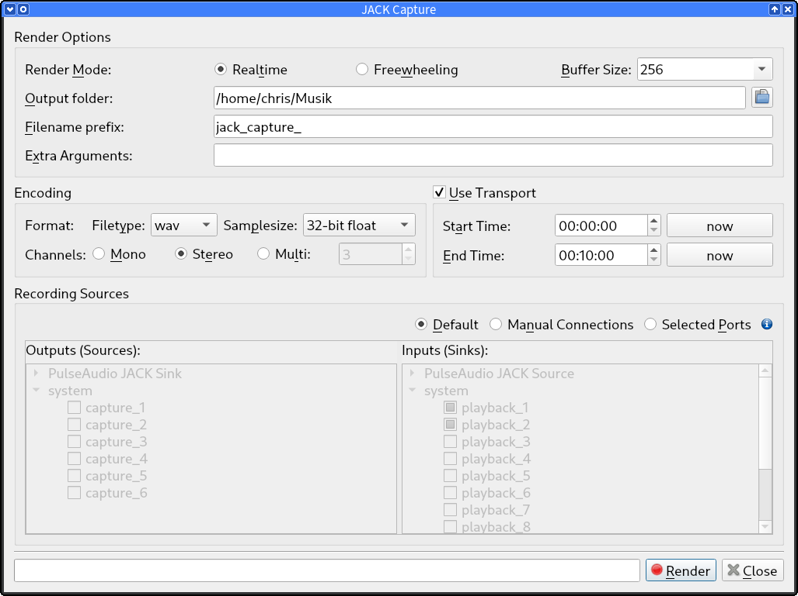

# QJackCapture

A GUI for easy recording of [JACK] audio sources using [jack_capture].




## Dependencies

To run **QJackCapture**, you need to have the following installed:

* [JACK] server and library
* [jack_capture]
* Python 3 and [PyQt5]
* [pyjacklib]
* [natsort]

To build and install it, you additionally need:

* `make`
* `pyuic5`
* `pyrcc5`
* [setuptools]
* (optional) [pip]


## Building and Installing

```con
make
[sudo] make install
```

Or, if you want to install via `pip` and let it install any missing required
Python packages:

```con
make
[sudo] make install-pip
```

The install commands respect the usual `PREFIX` and `DESTDIR` variables.


## Running

After installation, make sure that the JACK server is running and then just use
your desktop menu to start QJackCapture or run `qjackcapture` from a terminal
or your preferred launcher.


## License

**QJackCapture** is licensed under the GNU Public License Version v2, or
any later version.

Please see the file [LICENSE] for more information.


## Authors

Created by *Filipe Coelho (falkTX)* as the "Render" tool part of [Cadence].

Turned into a stand-alone project and enhanced by *Christopher Arndt*.


[Cadence]: https://github.com/falkTX/Cadence.git
[jack_capture]: https://github.com/kmatheussen/jack_capture
[JACK]: https://jackaudio.org/
[LICENSE]: https://github.com/SpotlightKid/qjackcapture/blob/master/LICENSE
[natsort]: https://github.com/SethMMorton/natsort
[pip]: https://pypi.org/project/pip/
[pyjacklib]: https://github.com/jackaudio/pyjacklib
[PyQt5]: https://www.riverbankcomputing.com/software/pyqt/
[setuptools]: https://pypi.org/project/setuptools/
